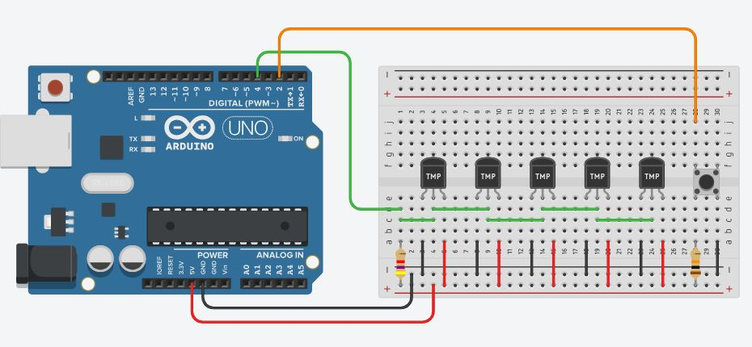

# Setup Medición de temperatura

## Componentes

El siguiente setup está conformado por:
- 1 Arduino UNO
- 5 sensores de temperatura DS18B20
- 1 resistencia de 4K7
- 1 resistencia de 10K
- 1 pulsador (contectado en configuración pull-up)

